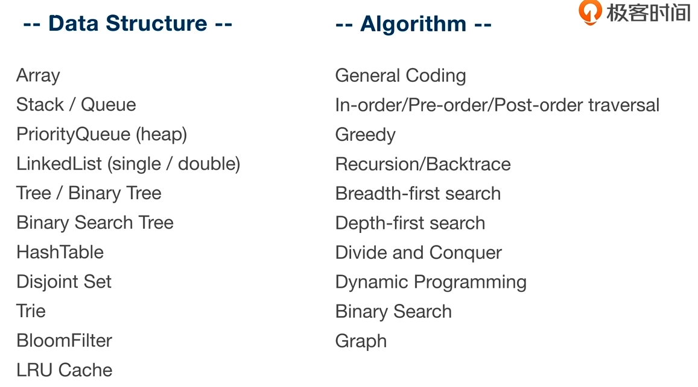

### 如果题目中的input是array， vector，问index， 考虑使用map
- 1. Two Sum 

### 如果题目中的input是array， vector，问是否存在某个解， 考虑使用set
- 1346. Check If N and Its Double Exist

### 如果题目中的input是string，如果需要对字符进行计数， 考虑使用char[26]
- 

### 如果题目中要看两个元素是否一样多（并不要求知道具体有多少），考虑使用一个计数器，对一个用+，另一个用- 
- 1221. Split a String in Balanced Strings


### 如果题目中出现 sorted，一定要考虑binary search
```
lower_bound(begin(sortedNums), end(sortedNums), nums[i])
```

### 编程中出现除法，一定要检测除数（divisor）是否为0， 为了省去判断，可以把除法转化成乘法
- 1232. Check If It Is a Straight Line
 
