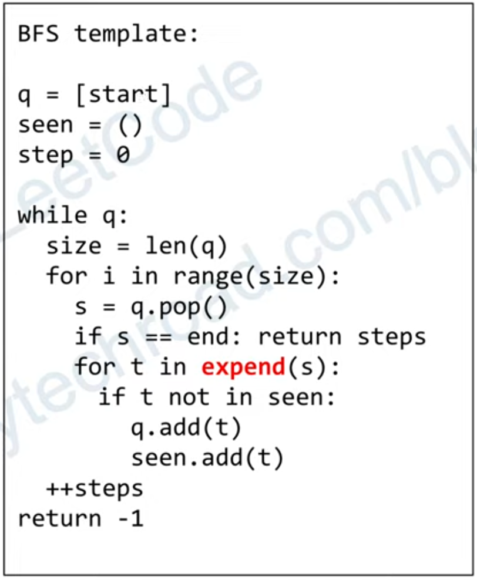

# BFS
## Search 

## Code template
- Path length
```
  int steps = 0;
  queue<T> q;
  unordered_set<T> visited;

  q.push<init_value>;
  visited.insert<init_value>;

  while (q.size())
  {
    int size = q.size();
    while (size--)
    {
      auto curr = q.front();
      q.pop();
        
      q.push(nextLevel);
      }
    }
    ++steps;
  }
``` 
- Check
```
  bool isPrerequisite(int source, int target, vector<vector<int>> graph)
  {
    queue<int> q;
    unordered_set<int> visited;
    q.push(source);
    visited.insert(source);

    while (!q.empty())
    {
      int src = q.front();
      for (auto next : graph[src])
      {
        if (visited.count(next))
        {
          continue;
        }
        if (next == target)
        {
          return true;
        }
        visited.insert(next);
        q.push(next);
      }
    }
    return false;
  }
```

- 433. Minimum Genetic Mutation                     # BFS Shortest Path
- 542. 01 Matrix
- 690. Employee Importance
- 752. Open the Lock                                # BFS search
- 909. Snakes and Ladders
- 994. Rotting Oranges
- 1091. Shortest Path in Binary Matrix
- 1129. Shortest Path with Alternating Colors
- 1162. As Far from Land as Possible                # queue
- 1284. Minimum Number of Flips to Convert Binary Matrix to Zero Matrix     # BFS Search
- 1298. Maximum Candies You Can Get from Boxes
- 1305. All Elements in Two Binary Search Trees
- 1306. Jump Game III                     # bfs search 
- 1311. Get Watched Videos by Your Friends
- 1466. Reorder Routes to Make All Paths Lead to the City Zero
- 1462. Course Schedule IV

