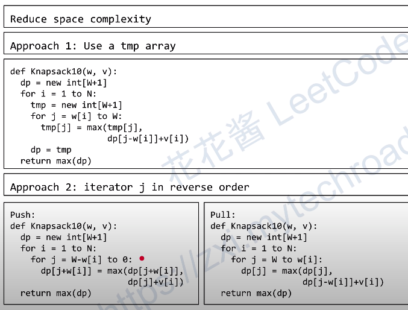

# Knapsack

## 0-1 Knapsack
0-1 Knapsack problem is Non-deterministic Polynomial Complete Problem

### Solution 1: Search
Time complex: O(N^2) , 只适用于N较小的情况

Space complex: O(N)

```
  # s 表示从第几件开始取
  def dfs( s, cur_w, cur_v):
    ans = max(anx, currv)
    if s > N : turn
    for i in range(s, N+1):
      if(curr_w + w[i] < W):
        dfs(i + 1, curr_w + w[i], cur_v + v[i])


  def knapscak01(w, v):
    ans = 0
    dfs(1, 0, 0)
    return ans
```
### Solution 2: Recursion with memoization
当有overlapping subproblem时，可以用Recursion with memoization来优化search

dp(i, j) := max value of using first i items that has exact weight of j

dp(*, 0) = 0   j=0 weight表示没有任何item，是为终止条件

Time complex: O(NW) * O(1) 一共有N*W个subproblem

Space complex: O(NW) 

### Solution 3: DP
dp[i][j] := max value of using first i items that has total weight of j

遍历i之前所有重量为j-w[i]的组合
dp[i][j] = max{dp[i-1][j-w[i]]+v[i]}     w[j] <=j <=W    

```
  def knapscak01(w, v):
    dp = new int[N+1][W+1]
    for i = 1 to N:
      for j = w[i] to W:
        dp[i][j] = max(dp[i,j], dp[i-1][j-w[i]]+v[i])
    return ans
```

### Solution 4: DP 降维



## Reference
- [背包问题九讲](https://www.kancloud.cn/kancloud/pack/70124)
- [花花酱 0-1 Knapsack Problem 01背包问题 - 刷题找工作 SP10](https://www.youtube.com/watch?v=CO0r6kcwHUU)
- [花花酱 Knapsack Problem 背包问题 2 - 刷题找工作 SP11](https://www.youtube.com/watch?v=rM_G4dboKhc)

## Problems
