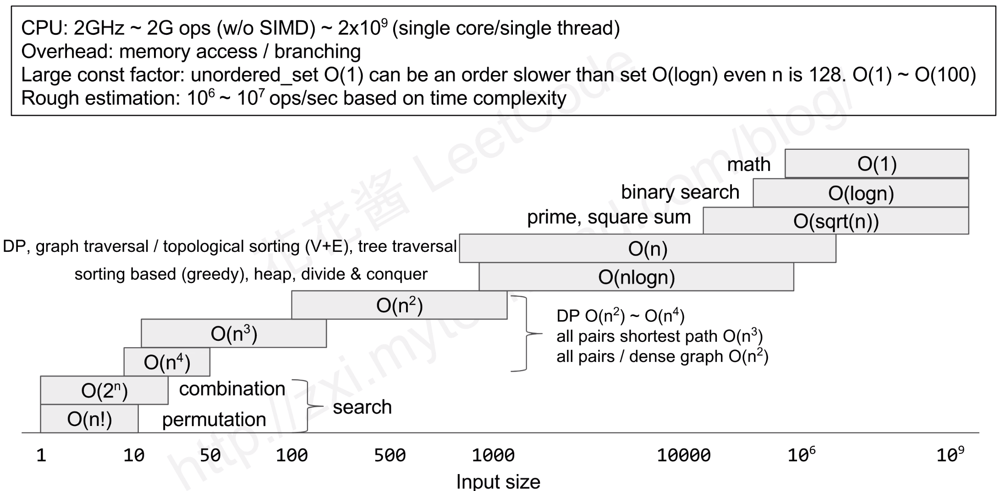
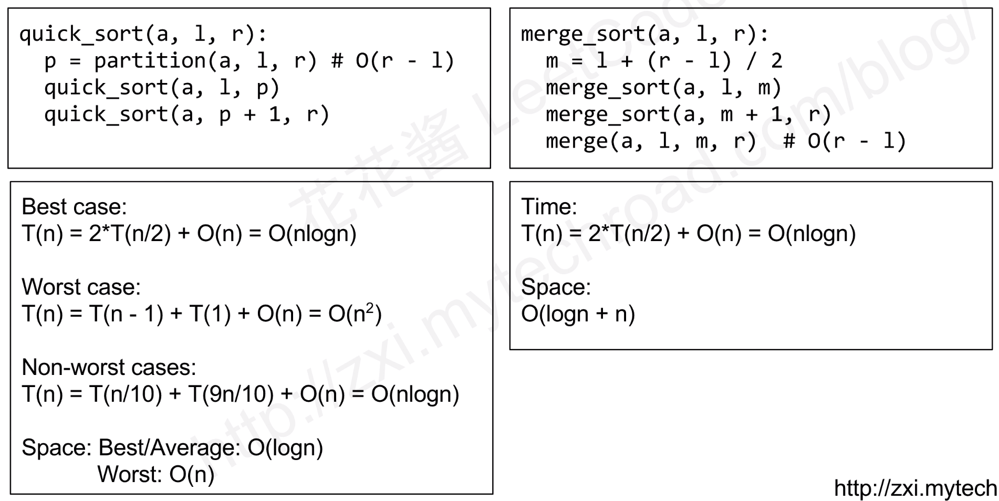
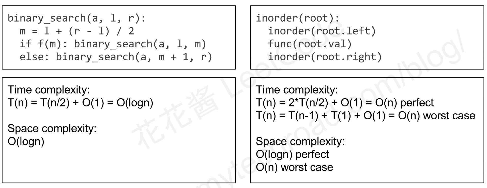
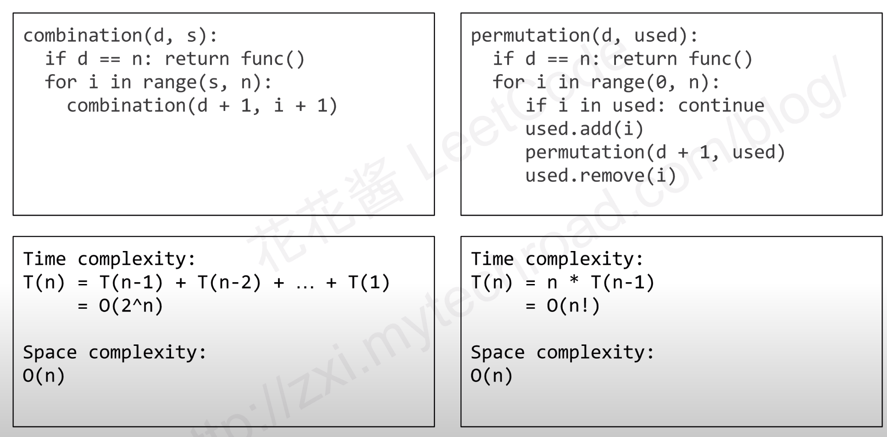

## Complexity
- O(1) or O(C): constant time
- O(log2N)    : sub-linear time
- O(N)        : linear time
- O(Nlog2N)   : 
- O(N^2)      : quadratic time
- O(N^3)      : cubic time
- O(2^N)      : exponential time

## Input Size V.S. Time Complexity

## Time/Space Complexity of Recursive

Space Complexity由递归深度决定，最好情况为O(logN)，最差为O(N)

Merge Sort需要copy，需要额外空间和时间

